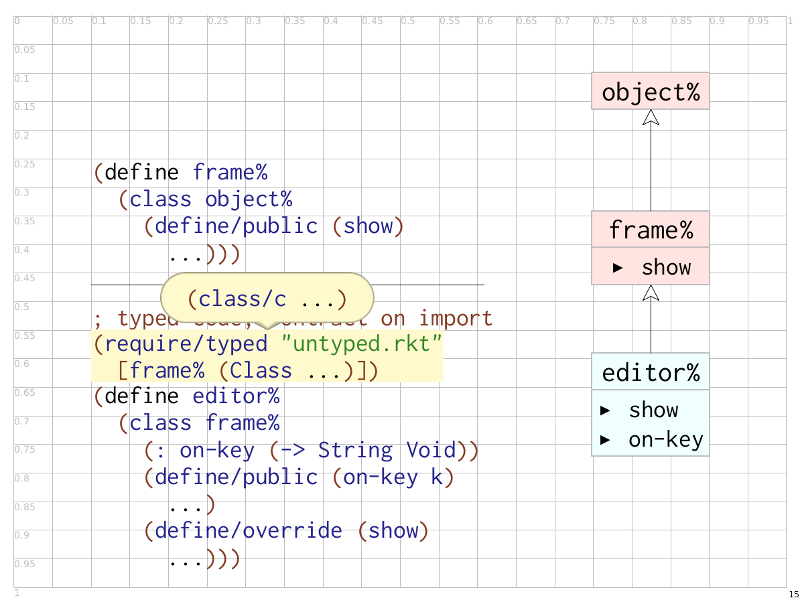

ppict-slide-grid
----------------

This package provides a function that sets up a grid on
[ppict](www.cs.utah.edu/plt/snapshots/current/doc/unstable-gui/ppict.html)-based
slides that can be handy for judging the coordinates to use for
placing slide elements.

Screenshot:
  

To use, just put the following at the top of your slideshow:

    (require ppict-slide-grid)
    (set-grid-base-pict!)

Make sure to disable it for your actual talk!

---

Copyright (c) 2014 Asumu Takikawa

This program is free software: you can redistribute it and/or modify it under
the terms of the GNU Lesser General Public License as published by the Free
Software Foundation, either version 3 of the License, or (at your option) any
later version.

This program is distributed in the hope that it will be useful, but WITHOUT ANY
WARRANTY; without even the implied warranty of MERCHANTABILITY or FITNESS FOR A
PARTICULAR PURPOSE.  See the GNU Lesser General Public License for more
details.

You should have received a copy of the GNU Lesser General Public License along
with this program.  If not, see http://www.gnu.org/licenses.
